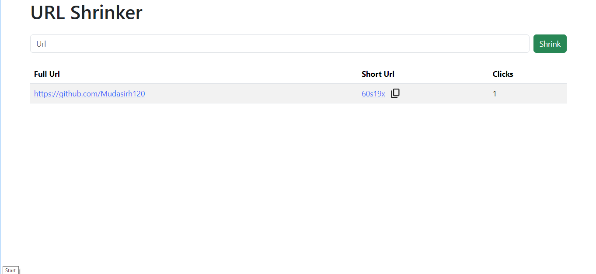

# LinkShortner

**A simple and fast URL shortening service built with Node.js, Express, and MongoDB.**

Shorten long URLs, share them easily, and track the number of clicks.

---

## Features

- Shorten long URLs into easy-to-share links
- Track click counts for each link
- clean and minimal interface
- Deployed online for live access

---

## Tech Stack

- **Backend:** Node.js, Express.js
- **Frontend:** EJS,
- **Database:** MongoDB
- **Deployment:** Vercel

---

## Installation

1. Clone the repository:

```bash
git clone https://github.com/Mudasirh120/LinkShortner.git
```

2. Install dependencies:

```bash
npm install
```

3. Create a `.env` file and add your MongoDB URI:

```
MONGODB_URL=your_mongodb_connection_string
PORT=5001
```

4. Start the server:

```bash
npm run dev
```

5. Open `http://localhost:5001` in your browser.

---

## Usage

1. Paste a long URL into the input field
2. Click “Shrink”
3. Copy the generated short link and share it

---

## Screenshots


